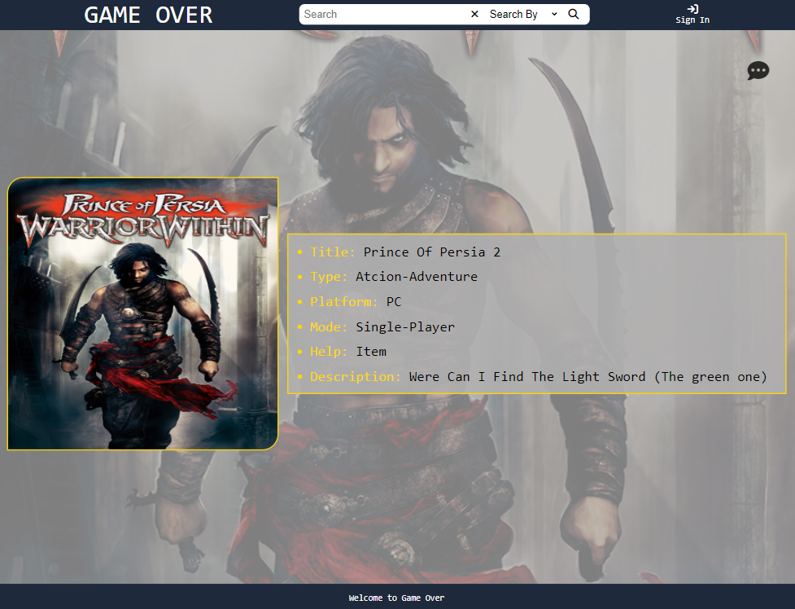
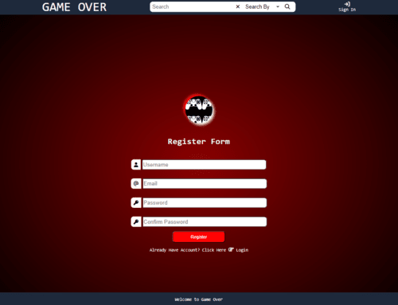
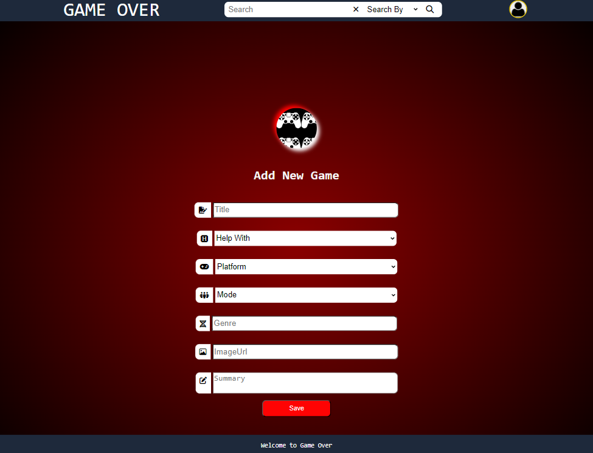
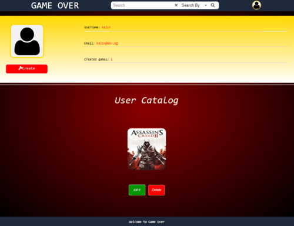

# Game-Over

This is my first React project, it's a forum type website where you can exchange information about games.

- clicking on the `details` button you can find more information about the post

- if you want to check the post comments click on the comment `icon` or the `comment` button
- but if you want to leave a comment you will have to register first

- you can create your own profile by registering
  

- after the user has registered successfully he can create his  own post

- which are going to be visible in his profile page were the user can edit or delete them

## Folder Structure

- `/public`: Here are all the css files and images used in the app.
- `/src`: The main source directory of the application.
    - `/components`: All the components of the application.
    - `/404`
    - `/Catalog`
    - `/Comments`
    - `/Create`
    - `/Details`
    - `/Edit`
    - `/Footer`
    - `/GoToTopButton`
    - `/Header`
    - `/Home`
    - `/Login`
    - `/Logout`
    - `/Profile`
    - `/Register`
    - `/RouteGuat`
- `/context`:  Function used for importing and exporting context from all components.
- `/hooks`: All the custom hooks used in the app.
- `/service`: All the server service used for handling the data.
- `/utils`: All the custom checks.

## Routing

The project uses the routing library React Router to navigate between the components and display the appropriate views based on the user's actions.

## Service

### Auth Service

The `authService` is responsible for managing user-related data and actions like, user login, user registration, and retrieval of user details.

### Game Service

The `gameService` is responsible for handling data related to games, fetch game, delete game, update game and create game.

### Game Comment Service

Like the `gameService`, the `gameCommentService` is responsible for handling data related to game comments, fetch comments, delete comment, update comment and create comment.

## Usage Guide

### Installation

1. Clone this repository on your local machine.
2. Open a terminal and navigate to the client directory with the command `cd client`.
3. Run the command `npm install` or `npm i` to install the necessary dependencies.

### Running the Application

1. In the terminal, navigate to the server directory using the command `cd server`.
2. Run the command `node server.js` to start the server. The server will run on port 3030.
3. In a new terminal window, navigate to the client directory using the command `cd client`.
4. Run the command `npm start` to start the client. The client will run on port 3000.

### Accessing the Application

1. Open a web browser.
2. Navigate to `http://localhost:3000` to access the client side of the application.
3. To access the server side of the application, you can use HTTP requests to `http://localhost:3030`.

These instructions should help users install and run the application successfully. 
